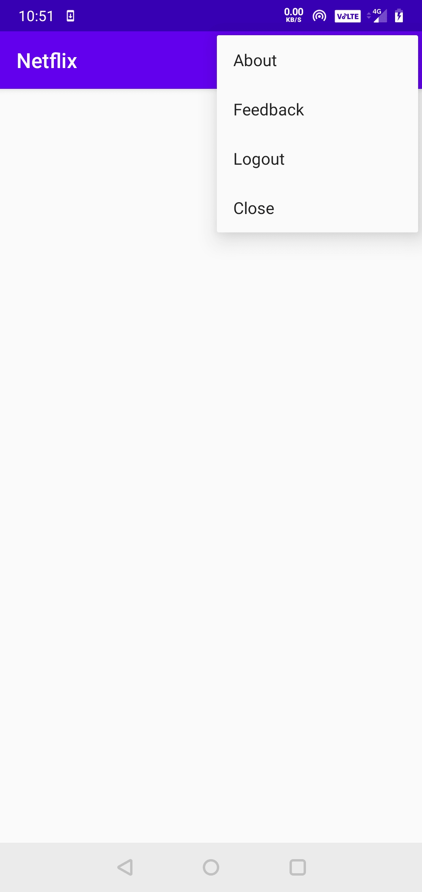

# Firebase.login.with.Netflix.interface
Firebase login and register with cool netflix ui and with user feedback system

### We have following activities in our application
 ****

  - Registration Activity
  - Login Activity
  - Main Activity
  - Feedback Activity
  - About Activity
  
### Registration
**** 
Here the user register for the application using mail id which is authenticated using firebase.

### Login
**** 
Here the Registered user is allowed to login to their account
authenticated using firebase.

### Main Layout
****
Here the user can add any activity whaterer they need.

### Feedback
****
Here the user can send the feedback about the app.
which will be stored in firese bucket.

### About
****
Here the user can view about the app details or developer Details

### Execution
 ****
- The Login and Registration process is by connecting to firebase.
- The feedback is stored in firebase realtime database.

### Application user interface
 ****
<table>
  <tr>
    <td>Welcome Screen</td>
     <td>Registration Page</td>
     <td>Login Page</td>
  </tr>
  <tr>
    <td></td>
    <td></td>
    <td></td>
  </tr>
  <tr>
        <td>Main layout</td>
     <td>feedback Page</td>
     <td> about Page </td>
  </tr>
  <tr>
    <td></td>
    <td></td>
    <td></td>
  </tr>
 </table>

Thank you...
